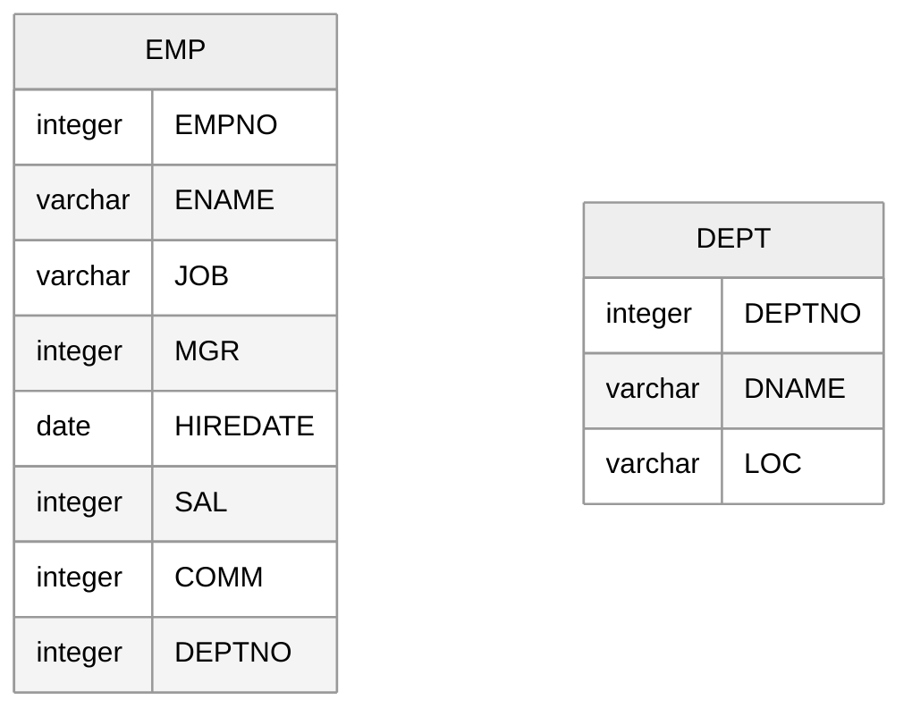

# SQL Query Note

データ分析の前処理を行う際に、少し頭を捻る必要がありそうなデータ加工や分析系 SQL のアイデア、SQL の Tips をまとめているノート。ノートと言っても見やすいものではなく、計算用紙のようなイメージ。

下記の通り SQL は見やすく、最適化されているものでもない。

- 基本的な関数の使用方法などは説明していない
- 基本的にはサブクエリは利用しておらず、`with`を利用している
- テーブル名、カラム名は適当なものではない
- インデントに関しても適当なものではない
- 計算過程を見るために、不要なカラムが`select`されているケースもある
- 計算過程を見るために、`with`の階層が無駄に細かい場合があり、後続の処理で不要であっても修正してない
- カラム前に`,`をつけるのではなく、カラム後に`,`をつけている
- `* join`でのレコード大爆発はスペック上げることで対応してもらう前提
- 下記の Page はジャンル分けされてない

**誤っている可能性もあるので、アイデアを参考にする際は、必ず使用するテーブルと集計定義に合わせて、SQL を修正すること。**

- [Page000-連続した日付を生成する.md](https://github.com/SugiAki1989/sql_note/blob/main/P000-%E9%80%A3%E7%B6%9A%E3%81%97%E3%81%9F%E6%97%A5%E4%BB%98%E3%82%92%E6%A8%A1%E6%93%AC%E3%83%AB%E3%83%BC%E3%83%97%E3%81%A7%E7%94%9F%E6%88%90%E3%81%99%E3%82%8B.md)
- [Page001-SQL の評価順序.md](https://github.com/SugiAki1989/sql_note/blob/main/P001-SQL%E3%81%AE%E8%A9%95%E4%BE%A1%E9%A0%86%E5%BA%8F.md)
- [Page002-not in と null の関係.md](https://github.com/SugiAki1989/sql_note/blob/main/P002-not%20in%E3%81%A8null%E3%81%AE%E9%96%A2%E4%BF%82.md)
- [Page003-innerjoin と where 結合.md](https://github.com/SugiAki1989/sql_note/blob/main/P003-innerjoin%E3%81%A8where%E7%B5%90%E5%90%88.md)
- [Page004-単純ケース式と検索ケース式.md](https://github.com/SugiAki1989/sql_note/blob/main/P004-%E5%8D%98%E7%B4%94%E3%82%B1%E3%83%BC%E3%82%B9%E5%BC%8F%E3%81%A8%E6%A4%9C%E7%B4%A2%E3%82%B1%E3%83%BC%E3%82%B9%E5%BC%8F.md)
- [Page005-0-except でテーブル類似性を確認.md](https://github.com/SugiAki1989/sql_note/blob/main/P005-0-except%20%E3%81%A7%E3%83%86%E3%83%BC%E3%83%96%E3%83%AB%E9%A1%9E%E4%BC%BC%E6%80%A7%E3%82%92%E7%A2%BA%E8%AA%8D.md)
- [Page005-1-join でテーブル類似性を確認.md](https://github.com/SugiAki1989/sql_note/blob/main/P005-1-join%E3%81%A7%E3%83%86%E3%83%BC%E3%83%96%E3%83%AB%E9%A1%9E%E4%BC%BC%E6%80%A7%E3%82%92%E7%A2%BA%E8%AA%8D.md)
- [Page005-2-削除、修正、追加されたデータを確認.md](https://github.com/SugiAki1989/sql_note/blob/main/P005-2-%E5%89%8A%E9%99%A4%E3%80%81%E4%BF%AE%E6%AD%A3%E3%80%81%E8%BF%BD%E5%8A%A0%E3%81%95%E3%82%8C%E3%81%9F%E3%83%87%E3%83%BC%E3%82%BF%E3%82%92%E7%A2%BA%E8%AA%8D.md)
- [Page006-sum(distinct)について.md](<https://github.com/SugiAki1989/sql_note/blob/main/P006-sum(distinct)%E3%81%AB%E3%81%A4%E3%81%84%E3%81%A6.md>)
- [Page007-文字列の反復処理には replace(translate).md](<https://github.com/SugiAki1989/sql_note/blob/main/P007-%E6%96%87%E5%AD%97%E5%88%97%E3%81%AE%E5%8F%8D%E5%BE%A9%E5%87%A6%E7%90%86%E3%81%AB%E3%81%AFreplace(translate).md>)
- [Page008-0-wide2long 変換.md](https://github.com/SugiAki1989/sql_note/blob/main/P008-0-wide2long%E5%A4%89%E6%8F%9B%20.md)
- [Page008-1-区切り文字レコードで wide2long 変換.md](https://github.com/SugiAki1989/sql_note/blob/main/P008-1-%E5%8C%BA%E5%88%87%E3%82%8A%E6%96%87%E5%AD%97%E3%83%AC%E3%82%B3%E3%83%BC%E3%83%89%E3%81%A7wide2long%E5%A4%89%E6%8F%9B.md)
- [Page008-2-周期を利用した wide2long 変換.md](https://github.com/SugiAki1989/sql_note/blob/main/P008-2-%E5%91%A8%E6%9C%9F%E3%82%92%E5%88%A9%E7%94%A8%E3%81%97%E3%81%9Fwide2long%E5%A4%89%E6%8F%9B.md)
- [Page008-3-PostgreSQL の crosstab 関数.md]()
- [Page009-0- 日時の形式変換.md](https://github.com/SugiAki1989/sql_note/blob/main/P009-0-PostgesSQL%E3%81%A8MySQL%E3%81%AE%E6%97%A5%E6%99%82%E3%81%AE%E5%BD%A2%E5%BC%8F%E5%A4%89%E6%8F%9B.md)
- [Page009-1− 日時演算.md](https://github.com/SugiAki1989/sql_note/blob/main/P009-1-PostgesSQL%E3%81%A8MySQL%E3%81%AE%E6%97%A5%E6%99%82%E6%BC%94%E7%AE%97.md)
- [Page010-UNIX 秒を利用した任意の時間単位での集計.md](https://github.com/SugiAki1989/sql_note/blob/main/P010-UNIX%E7%A7%92%E3%82%92%E5%88%A9%E7%94%A8%E3%81%97%E3%81%9F%E4%BB%BB%E6%84%8F%E3%81%AE%E6%99%82%E9%96%93%E5%8D%98%E4%BD%8D%E3%81%A7%E3%81%AE%E9%9B%86%E8%A8%88.md)
- [Page011-対数で累積積.md](https://github.com/SugiAki1989/sql_note/blob/main/P011-%E5%AF%BE%E6%95%B0%E3%81%A7%E7%B4%AF%E7%A9%8D%E7%A9%8D.md)
- [Page012-MySQL で中央値の計算(検証中).md](https://github.com/SugiAki1989/sql_note/blob/main/P012-MySQL%E3%81%A7%E4%B8%AD%E5%A4%AE%E5%80%A4%E3%81%AE%E8%A8%88%E7%AE%97.md)
- [Page013-月曜日に関する前処理.md](https://github.com/SugiAki1989/sql_note/blob/main/P013-%E6%9C%88%E6%9B%9C%E6%97%A5%E3%81%AB%E9%96%A2%E3%81%99%E3%82%8B%E5%89%8D%E5%87%A6%E7%90%86.md)
- [Page014-0-日付期間のオーバーラップ判定.md](https://github.com/SugiAki1989/sql_note/blob/main/P014-0-%E6%97%A5%E4%BB%98%E6%9C%9F%E9%96%93%E3%81%AE%E3%82%AA%E3%83%BC%E3%83%90%E3%83%BC%E3%83%A9%E3%83%83%E3%83%97%E5%88%A4%E5%AE%9A.md)
- [Page014-1-値範囲のオーバーラップ判定.md](https://github.com/SugiAki1989/sql_note/blob/main/P014-1-%E5%80%A4%E7%AF%84%E5%9B%B2%E3%81%AE%E3%82%AA%E3%83%BC%E3%83%90%E3%83%BC%E3%83%A9%E3%83%83%E3%83%97%E5%88%A4%E5%AE%9A.md)
- [Page014-2-値範囲のオーバーラップ判定の応用編.md](https://github.com/SugiAki1989/sql_note/blob/main/P014-2-%E5%80%A4%E7%AF%84%E5%9B%B2%E3%81%AE%E3%82%AA%E3%83%BC%E3%83%90%E3%83%BC%E3%83%A9%E3%83%83%E3%83%97%E5%88%A4%E5%AE%9A%E3%81%AE%E5%BF%9C%E7%94%A8%E7%B7%A8.md)
- [Page015-0-期間不明の期間内集計.md](https://github.com/SugiAki1989/sql_note/blob/main/P015-0-%E6%9C%9F%E9%96%93%E4%B8%8D%E6%98%8E%E3%81%AE%E6%9C%9F%E9%96%93%E5%86%85%E9%9B%86%E8%A8%88.md)
- [Page015-1-数列を分割して集計する.md](https://github.com/SugiAki1989/sql_note/blob/main/P015-1-%E6%95%B0%E5%88%97%E3%82%92%E5%88%86%E5%89%B2%E3%81%97%E3%81%A6%E9%9B%86%E8%A8%88.md)
- [Page015-2-繰り返す値を分割して集計する.md](https://github.com/SugiAki1989/sql_note/blob/main/P015-2-%E7%B9%B0%E3%82%8A%E8%BF%94%E3%81%99%E5%80%A4%E3%82%92%E5%88%86%E5%89%B2%E3%81%97%E3%81%A6%E9%9B%86%E8%A8%88%E3%81%99%E3%82%8B.md)
- [Page015-3-数列が飛んだらパッキングする.md](https://github.com/SugiAki1989/sql_note/blob/main/P015-3-%E6%95%B0%E5%88%97%E3%81%8C%E9%A3%9B%E3%82%93%E3%81%A0%E3%82%89%E3%83%91%E3%83%83%E3%82%AD%E3%83%B3%E3%82%B0%E3%81%99%E3%82%8B.md)
- [Page015-4-特定の条件で連続する区間を表示する.md](https://github.com/SugiAki1989/sql_note/blob/main/P015-4-%E7%89%B9%E5%AE%9A%E3%81%AE%E6%9D%A1%E4%BB%B6%E3%81%A7%E9%80%A3%E7%B6%9A%E3%81%99%E3%82%8B%E5%8C%BA%E9%96%93%E3%82%92%E8%A1%A8%E7%A4%BA%E3%81%99%E3%82%8B.md)
- [Page015-5-期間不明の期間内集計その 2.md](https://github.com/SugiAki1989/sql_note/blob/main/P015-5-%E6%9C%9F%E9%96%93%E4%B8%8D%E6%98%8E%E3%81%AE%E6%9C%9F%E9%96%93%E5%86%85%E9%9B%86%E8%A8%88%E3%81%9D%E3%81%AE2.md)
- [Page016-Recursive CTE の基礎.md](https://github.com/SugiAki1989/sql_note/blob/main/P016-Recursive%20CTE%E3%81%AE%E5%9F%BA%E7%A4%8E.md)
- [Page017-Recursive CTE の実践.md](https://github.com/SugiAki1989/sql_note/blob/main/P017-Recursive%20CTE%E3%81%AE%E5%AE%9F%E8%B7%B5.md)
- [Page018-0-相関サブクエリ.md](https://github.com/SugiAki1989/sql_note/blob/main/P018-0-%E7%9B%B8%E9%96%A2%E3%82%B5%E3%83%96%E3%82%AF%E3%82%A8%E3%83%AA.md)
- [Page018-1-(not)in と(not)exists.md](<https://github.com/SugiAki1989/sql_note/blob/main/P018-1-(not)in%E3%81%A8(not)exists.md>)
- [Page018-2-達人 SQL 本の exists(5 章)の説明.md](<https://github.com/SugiAki1989/sql_note/blob/main/P018-2-%E9%81%94%E4%BA%BASQL%E6%9C%AC%E3%81%AEexists(5%E7%AB%A0)%E3%81%AE%E8%AA%AC%E6%98%8E.md>)
- [Page018-3-相関サブクエリ集達人 SQL 本 7 章より.md](https://github.com/SugiAki1989/sql_note/blob/main/P018-3-%E7%9B%B8%E9%96%A2%E3%82%B5%E3%83%96%E3%82%AF%E3%82%A8%E3%83%AA%E9%9B%86~%E9%81%94%E4%BA%BASQL%E6%9C%AC7%E7%AB%A0%E3%82%88%E3%82%8A~.md)
- [Page019-null を fillup する.md](https://github.com/SugiAki1989/sql_note/blob/main/P019-null%E3%82%92fillup%E3%81%99%E3%82%8B.md)
- [Page020-過去 n 件の売上データを紐付ける.md](https://github.com/SugiAki1989/sql_note/blob/main/P020-%E9%81%8E%E5%8E%BBn%E4%BB%B6%E3%81%AE%E5%A3%B2%E4%B8%8A%E3%83%87%E3%83%BC%E3%82%BF%E3%82%92%E7%B4%90%E4%BB%98%E3%81%91%E3%82%8B.md)
- [Page021-0-名寄せの方法例.md](https://github.com/SugiAki1989/sql_note/blob/main/P021-0-%E5%90%8D%E5%AF%84%E3%81%9B%E3%81%AE%E6%96%B9%E6%B3%95%E4%BE%8B.md)
- [Page021-1-名寄せの方法例(fuzzyjoin).md](<https://github.com/SugiAki1989/sql_note/blob/main/P021-1-%E5%90%8D%E5%AF%84%E3%81%9B%E3%81%AE%E6%96%B9%E6%B3%95%E4%BE%8B(fuzzyjoin).md>)
- [Page022-テーブルの完全重複を検知.md](https://github.com/SugiAki1989/sql_note/blob/main/P022-%E3%83%86%E3%83%BC%E3%83%96%E3%83%AB%E3%81%AE%E5%AE%8C%E5%85%A8%E9%87%8D%E8%A4%87%E3%82%92%E6%A4%9C%E7%9F%A5.md)
- [Page023-ウインドウ関数の rows と range.md](https://github.com/SugiAki1989/sql_note/blob/main/P023-%E3%82%A6%E3%82%A4%E3%83%B3%E3%83%89%E3%82%A6%E9%96%A2%E6%95%B0%E3%81%AErows%E3%81%A8range.md)
- [Page024-0-PostgreSQL の cube 関数.md](https://github.com/SugiAki1989/sql_note/blob/main/P024-0-PostgreSQL%E3%81%AEcube%E9%96%A2%E6%95%B0%20copy.md)
- [Page024-1-PostgreSQL の rollup,groupingsets 関数.md](https://github.com/SugiAki1989/sql_note/blob/main/P024-1-PostgreSQL%E3%81%AErollup%2Cgroupingsets%E9%96%A2%E6%95%B0.md)
- [Page025-case in case で having.md](https://github.com/SugiAki1989/sql_note/blob/main/P025-case%20in%20case%E3%81%A7having.md)
- [Page026-行方向の平均.md](https://github.com/SugiAki1989/sql_note/blob/main/P026-%E8%A1%8C%E6%96%B9%E5%90%91%E3%81%AE%E5%B9%B3%E5%9D%87.md)
- [Page027-順列 nPr と組み合わせ nCr.md](https://github.com/SugiAki1989/sql_note/blob/main/P027-%E9%A0%86%E5%88%97nPr%E3%81%A8%E7%B5%84%E3%81%BF%E5%90%88%E3%82%8F%E3%81%9BnCr.md)
- [Page028-0-簡易ウインドウ関数(rank)を自作する.md](<https://github.com/SugiAki1989/sql_note/blob/main/P028-0-%E7%B0%A1%E6%98%93%E3%82%A6%E3%82%A4%E3%83%B3%E3%83%89%E3%82%A6%E9%96%A2%E6%95%B0(rank)%E3%82%92%E8%87%AA%E4%BD%9C%E3%81%99%E3%82%8B.md>)
- [Page028-1-簡易ウインドウ関数(moving average)を自作する.md](<https://github.com/SugiAki1989/sql_note/blob/main/P028-1-%E7%B0%A1%E6%98%93%E3%82%A6%E3%82%A4%E3%83%B3%E3%83%89%E3%82%A6%E9%96%A2%E6%95%B0(moving%20average)%E3%82%92%E8%87%AA%E4%BD%9C%E3%81%99%E3%82%8B.md>)
- [Page028-2-簡易ウインドウ関数(lag)を自作する.md](<https://github.com/SugiAki1989/sql_note/blob/main/P028-2-%E7%B0%A1%E6%98%93%E3%82%A6%E3%82%A4%E3%83%B3%E3%83%89%E3%82%A6%E9%96%A2%E6%95%B0(lag)%E3%82%92%E8%87%AA%E4%BD%9C%E3%81%99%E3%82%8B.md>)
- [Page029-all と any と value in (col, col, col).md](<https://github.com/SugiAki1989/sql_note/blob/main/P029-all%E3%81%A8any%E3%81%A8value%20in%20(col%2C%20col%2C%20col).md>)
- [Page030-直積から非等値結合まで.md](https://github.com/SugiAki1989/sql_note/blob/main/P030-%E7%9B%B4%E7%A9%8D%E3%81%8B%E3%82%89%E9%9D%9E%E7%AD%89%E5%80%A4%E7%B5%90%E5%90%88%E3%81%BE%E3%81%A7.md)
- [Page031-値の行間比較.md](https://github.com/SugiAki1989/sql_note/blob/main/P031-%E9%87%8D%E8%A4%87%E5%80%A4%E3%81%AE%E8%A1%8C%E9%96%93%E6%AF%94%E8%BC%83.md)
- [Page032-逆関係の値を探す.md](https://github.com/SugiAki1989/sql_note/blob/main/P032-%E9%80%86%E9%96%A2%E4%BF%82%E3%81%AE%E5%80%A4%E3%82%92%E6%8E%A2%E3%81%99.md)
- [Page033-達人 SQL 本の having(6 章)の説明.md](<https://github.com/SugiAki1989/sql_note/blob/main/P033-%E9%81%94%E4%BA%BASQL%E6%9C%AC%E3%81%AEhaving(6%E7%AB%A0)%E3%81%AE%E8%AA%AC%E6%98%8E.md>)
- [Page034-join の on で in を使う.md](https://github.com/SugiAki1989/sql_note/blob/main/P034-join%E3%81%AEon%E3%81%A7in%E3%82%92%E4%BD%BF%E3%81%86.md)
- [Page035-等しい部分集合を見つける.md](https://github.com/SugiAki1989/sql_note/blob/main/P035-%E7%AD%89%E3%81%97%E3%81%84%E9%83%A8%E5%88%86%E9%9B%86%E5%90%88%E3%82%92%E8%A6%8B%E3%81%A4%E3%81%91%E3%82%8B.md)
- [Page036-連続している空席番号問題.md](https://github.com/SugiAki1989/sql_note/blob/main/P036-%E9%80%A3%E7%B6%9A%E3%81%97%E3%81%A6%E3%81%84%E3%82%8B%E7%A9%BA%E5%B8%AD%E7%95%AA%E5%8F%B7%E5%95%8F%E9%A1%8C.md)
- [Page037-階段状に日付列を拡張したい.md](https://github.com/SugiAki1989/sql_note/blob/main/P037-%E9%9A%8E%E6%AE%B5%E7%8A%B6%E3%81%AB%E6%97%A5%E4%BB%98%E5%88%97%E3%82%92%E6%8B%A1%E5%BC%B5%E3%81%97%E3%81%9F%E3%81%84.md)
- [Page038-Excel のセル結合風を作成.md](https://github.com/SugiAki1989/sql_note/blob/main/P038-Excel%E3%81%AE%E3%82%BB%E3%83%AB%E7%B5%90%E5%90%88%E9%A2%A8%E3%82%92%E4%BD%9C%E6%88%90.md)
- [Page039-連続している文字の出現回数をカウントする.md](https://github.com/SugiAki1989/sql_note/blob/main/P039-%E9%80%A3%E7%B6%9A%E3%81%97%E3%81%A6%E3%81%84%E3%82%8B%E6%96%87%E5%AD%97%E3%81%AE%E5%87%BA%E7%8F%BE%E5%9B%9E%E6%95%B0%E3%82%92%E3%82%AB%E3%82%A6%E3%83%B3%E3%83%88%E3%81%99%E3%82%8B.md)
- [Page040-グループ識別子を作成する.md](https://github.com/SugiAki1989/sql_note/blob/main/P040-%E3%82%B0%E3%83%AB%E3%83%BC%E3%83%97%E8%AD%98%E5%88%A5%E5%AD%90%E3%82%92%E4%BD%9C%E6%88%90%E3%81%99%E3%82%8B.md)
- [Page041-ヒストグラムで可視化する.md](https://github.com/SugiAki1989/sql_note/blob/main/P041-%E3%83%92%E3%82%B9%E3%83%88%E3%82%B0%E3%83%A9%E3%83%A0%E3%81%A7%E5%8F%AF%E8%A6%96%E5%8C%96%E3%81%99%E3%82%8B.md)
- [Page042-ログを 3 秒単位で集計する.md](https://github.com/SugiAki1989/sql_note/blob/main/P042-%E3%83%AD%E3%82%B0%E3%82%923%E7%A7%92%E5%8D%98%E4%BD%8D%E3%81%A7%E9%9B%86%E8%A8%88%E3%81%99%E3%82%8B.md)
- [Page043-App のための where 1 = 1.md](https://github.com/SugiAki1989/sql_note/blob/main/P043-App%E3%81%AE%E3%81%9F%E3%82%81%E3%81%AEwhere%201%20%3D%201.md)
- [Page044-会計年度ごとに集計する.md](https://github.com/SugiAki1989/sql_note/blob/main/P044-%E4%BC%9A%E8%A8%88%E5%B9%B4%E5%BA%A6%E3%81%94%E3%81%A8%E3%81%AB%E9%9B%86%E8%A8%88%E3%81%99%E3%82%8B.md)
- [Page045-複数列から文字を検索する.md](https://github.com/SugiAki1989/sql_note/blob/main/P045-%E8%A4%87%E6%95%B0%E5%88%97%E3%81%8B%E3%82%89%E6%96%87%E5%AD%97%E3%82%92%E6%A4%9C%E7%B4%A2%E3%81%99%E3%82%8B.md)
- [Page046-増減表から人口推移を計算する.md](https://github.com/SugiAki1989/sql_note/blob/main/P046-%E4%BA%BA%E5%8F%A3%E7%B4%94%E5%A2%97%E6%B8%9B%E3%81%8B%E3%82%89%E4%BA%BA%E5%8F%A3%E6%8E%A8%E7%A7%BB%E3%82%92%E8%A8%88%E7%AE%97%E3%81%99%E3%82%8B.md)
- [Page047-集約後レコードを集約前に戻す.md](https://github.com/SugiAki1989/sql_note/blob/main/P047-%E9%9B%86%E7%B4%84%E5%BE%8C%E3%83%AC%E3%82%B3%E3%83%BC%E3%83%89%E3%82%92%E9%9B%86%E7%B4%84%E5%89%8D%E3%81%AB%E6%88%BB%E3%81%99.md)
- [Page048-超過累進課税の計算方法.md](https://github.com/SugiAki1989/sql_note/blob/main/P048-%E8%B6%85%E9%81%8E%E7%B4%AF%E9%80%B2%E8%AA%B2%E7%A8%8E%E3%81%AE%E8%A8%88%E7%AE%97%E6%96%B9%E6%B3%95.md)
- [Page049-SQL カレンダーを作成する.md](https://github.com/SugiAki1989/sql_note/blob/main/P049-SQL%E3%82%AB%E3%83%AC%E3%83%B3%E3%83%80%E3%83%BC%E3%82%92%E4%BD%9C%E6%88%90%E3%81%99%E3%82%8B.md)
- [Page050-隣接リストを可視化する.md](https://github.com/SugiAki1989/sql_note/blob/main/P050-%E9%9A%A3%E6%8E%A5%E3%83%AA%E3%82%B9%E3%83%88%E3%82%92%E5%8F%AF%E8%A6%96%E5%8C%96%E3%81%99%E3%82%8B.md)
- [Page051-SQL で ABC 分析.md](https://github.com/SugiAki1989/sql_note/blob/main/P051-SQL%E3%81%A7ABC%E5%88%86%E6%9E%90.md)
- [Page052-SQL で FanChart 分析.md](https://github.com/SugiAki1989/sql_note/blob/main/P052-SQL%E3%81%A7FanChart%E5%88%86%E6%9E%90.md)
- [Page053-SQL で デシル分析](https://github.com/SugiAki1989/sql_note/blob/main/P053-SQL%E3%81%A7App%E5%88%A9%E7%94%A8%E6%A9%9F%E8%83%BD%E5%88%86%E6%9E%90.md)
- [Page054-SQL で RFM 分析](https://github.com/SugiAki1989/sql_note/blob/main/P054-SQL%E3%81%A7RFM%E5%88%86%E6%9E%90.md)
- [Page055-SQL でアクション間隔分析.md](https://github.com/SugiAki1989/sql_note/blob/main/P055-SQL%E3%81%A7%E3%82%A2%E3%82%AF%E3%82%B7%E3%83%A7%E3%83%B3%E9%96%93%E9%9A%94%E5%88%86%E6%9E%90%20copy.md)
- [Page056-SQL でリピート分析](https://github.com/SugiAki1989/sql_note/blob/main/P056-SQL%E3%81%A7%E3%83%AA%E3%83%94%E3%83%BC%E3%83%88%E5%88%86%E6%9E%90.md)
- [Page057-SQL で正規化、スコア化する.md](https://github.com/SugiAki1989/sql_note/blob/main/P057-SQL%E3%81%A7%E6%AD%A3%E8%A6%8F%E5%8C%96%E3%80%81%E3%82%B9%E3%82%B3%E3%82%A2%E5%8C%96%E3%81%99%E3%82%8B.md)
- [Page058-SQL でアソシエーション分析.md](https://github.com/SugiAki1989/sql_note/blob/main/P058-SQL%E3%81%A7%E3%82%A2%E3%82%BD%E3%82%B7%E3%82%A8%E3%83%BC%E3%82%B7%E3%83%A7%E3%83%B3%E5%88%86%E6%9E%90.md)
- [Page059-SQL でファネル分析.md](https://github.com/SugiAki1989/sql_note/blob/main/P059-SQL%E3%81%A7%E3%83%95%E3%82%A1%E3%83%8D%E3%83%AB%E5%88%86%E6%9E%90.md)
- [Page060-0-SQL で登録後 n 日以内売上分析.md](https://github.com/SugiAki1989/sql_note/blob/main/P060-0-SQL%E3%81%A7%E7%99%BB%E9%8C%B2%E5%BE%8Cn%E6%97%A5%E4%BB%A5%E5%86%85%E5%A3%B2%E4%B8%8A%E5%88%86%E6%9E%90.md)
- [Page060-1-SQL で過去 n ヶ月のアクション数分析.md](https://github.com/SugiAki1989/sql_note/blob/main/P060-1-SQL%E3%81%A7%E9%81%8E%E5%8E%BBn%E3%83%B6%E6%9C%88%E3%81%AE%E3%82%A2%E3%82%AF%E3%82%B7%E3%83%A7%E3%83%B3%E6%95%B0%E5%88%86%E6%9E%90.md)
- [Page061-SQL でカゴ落ち分析.md](https://github.com/SugiAki1989/sql_note/blob/main/P061-SQL%E3%81%A7%E3%82%AB%E3%82%B4%E8%90%BD%E3%81%A1%E5%88%86%E6%9E%90.md)
- [Page062-SQL でコホート分析.md](https://github.com/SugiAki1989/sql_note/blob/main/P062-SQL%E3%81%A7%E3%82%B3%E3%83%9B%E3%83%BC%E3%83%88%E5%88%86%E6%9E%90.md)
- [Page063-SQL で継続率定着率分析.md](https://github.com/SugiAki1989/sql_note/blob/main/P063-SQL%E3%81%A7%E7%B6%99%E7%B6%9A%E7%8E%87%E5%AE%9A%E7%9D%80%E7%8E%87%E5%88%86%E6%9E%90.md)
- [Page064-SQL で続・継続率定着率分析.md](https://github.com/SugiAki1989/sql_note/blob/main/P064-SQL%E3%81%A7%E7%B6%9A%E3%83%BB%E7%B6%99%E7%B6%9A%E7%8E%87%E5%AE%9A%E7%9D%80%E7%8E%87%E5%88%86%E6%9E%90.md)
- [Page065-0-SQL で会員ステータスを判別する.md](https://github.com/SugiAki1989/sql_note/blob/main/P065-0-SQL%E3%81%A7%E4%BC%9A%E5%93%A1%E3%82%B9%E3%83%86%E3%83%BC%E3%82%BF%E3%82%B9%E3%82%92%E5%88%A4%E5%88%A5%E3%81%99%E3%82%8B.md)
- [Page065-1-SQL で会員ステータスを集計する.md](https://github.com/SugiAki1989/sql_note/blob/main/P065-1-SQL%E3%81%A7%E4%BC%9A%E5%93%A1%E3%82%B9%E3%83%86%E3%83%BC%E3%82%BF%E3%82%B9%E3%82%92%E9%9B%86%E8%A8%88%E3%81%99%E3%82%8B.md)
- [Page066-SQL で経過日数テーブルを作成する.md](https://github.com/SugiAki1989/sql_note/blob/main/P066-SQL%E3%81%A7%E7%B5%8C%E9%81%8E%E6%97%A5%E6%95%B0%E3%83%86%E3%83%BC%E3%83%96%E3%83%AB%E3%82%92%E4%BD%9C%E6%88%90%E3%81%99%E3%82%8B.md)
- [Page067-1-SQL で生存分析(KM 曲線).md](<https://github.com/SugiAki1989/sql_note#:~:text=P067%2D1%2DSQL%E3%81%A7%E7%94%9F%E5%AD%98%E5%88%86%E6%9E%90(KM%E6%9B%B2%E7%B7%9A).md>)
- [Page067-2-SQL で生存分析(KM 曲線).md](<https://github.com/SugiAki1989/sql_note/blob/main/P067-2-SQL%E3%81%A7%E7%94%9F%E5%AD%98%E5%88%86%E6%9E%90(KM%E6%9B%B2%E7%B7%9A).md>)
- [Page068-SQL で簡易統計解析処理](https://github.com/SugiAki1989/sql_note/blob/main/P068-SQL%E3%81%A7%E7%B5%B1%E8%A8%88%E8%A7%A3%E6%9E%90%E5%87%A6%E7%90%86.md)
- [Page069-join の on と where のうっかりミス.md](https://github.com/SugiAki1989/sql_note/blob/main/P069-join%E3%81%AEon%E3%81%A8where%E3%81%AE%E3%81%86%E3%81%A3%E3%81%8B%E3%82%8A%E3%83%9F%E3%82%B9.md)
- [Page070-在庫と注文の問題.md](https://github.com/SugiAki1989/sql_note/blob/main/P070-%E5%9C%A8%E5%BA%AB%E3%81%A8%E6%B3%A8%E6%96%87%E3%81%AE%E5%95%8F%E9%A1%8C.md)
- [Page071-ボールの箱詰め問題.md](https://github.com/SugiAki1989/sql_note/blob/main/P071-%E3%83%9C%E3%83%BC%E3%83%AB%E3%81%AE%E7%AE%B1%E8%A9%B0%E3%82%81%E5%95%8F%E9%A1%8C.md)
- [Page072-関係除算のまとめ.md](https://github.com/SugiAki1989/sql_note/blob/main/P072-%E9%96%A2%E4%BF%82%E9%99%A4%E7%AE%97%E3%81%AE%E3%81%BE%E3%81%A8%E3%82%81.md)
- [Page073-集合の性質を調べる having.md](https://github.com/SugiAki1989/sql_note/blob/main/P073-%E9%9B%86%E5%90%88%E3%81%AE%E6%80%A7%E8%B3%AA%E3%82%92%E8%AA%BF%E3%81%B9%E3%82%8Bhaving.md)
- [Page074-負の mod について.md](https://github.com/SugiAki1989/sql_note/blob/main/P074-%E8%B2%A0%E3%81%AEmod%E3%81%AB%E3%81%A4%E3%81%84%E3%81%A6.md)
- [Page075-SQL でサービス継続率と被アクション数の相関分析.md](https://github.com/SugiAki1989/sql_note/blob/main/P075-SQL%E3%81%A7%E3%82%B5%E3%83%BC%E3%83%93%E3%82%B9%E7%B6%99%E7%B6%9A%E7%8E%87%E3%81%A8%E8%A2%AB%E3%82%A2%E3%82%AF%E3%82%B7%E3%83%A7%E3%83%B3%E6%95%B0%E3%81%AE%E7%9B%B8%E9%96%A2%E5%88%86%E6%9E%90.md)
- [Page076-存在しない期間を集計対象にする方法.md](https://github.com/SugiAki1989/sql_note/blob/main/P076-%E5%AD%98%E5%9C%A8%E3%81%97%E3%81%AA%E3%81%84%E6%9C%9F%E9%96%93%E3%82%92%E9%9B%86%E8%A8%88%E5%AF%BE%E8%B1%A1%E3%81%AB%E3%81%99%E3%82%8B%E6%96%B9%E6%B3%95.md)
- [Page077-0− 時系列データから季節性と傾向を抽出する.md](https://github.com/SugiAki1989/sql_note/blob/main/P077-0%E2%88%92%E6%99%82%E7%B3%BB%E5%88%97%E3%83%87%E3%83%BC%E3%82%BF%E3%81%8B%E3%82%89%E5%AD%A3%E7%AF%80%E6%80%A7%E3%81%A8%E5%82%BE%E5%90%91%E3%82%92%E6%8A%BD%E5%87%BA%E3%81%99%E3%82%8B.md)
- [Page077-1− 時系列データを季節調整する.md](https://github.com/SugiAki1989/sql_note/blob/main/P077-1%E2%88%92%E6%99%82%E7%B3%BB%E5%88%97%E3%83%87%E3%83%BC%E3%82%BF%E3%82%92%E5%AD%A3%E7%AF%80%E8%AA%BF%E6%95%B4%E3%81%99%E3%82%8B.md)
- [Page078-営業日単位で集計する方法.md](https://github.com/SugiAki1989/sql_note/blob/main/P078-%E5%96%B6%E6%A5%AD%E6%97%A5%E5%8D%98%E4%BD%8D%E3%81%A7%E9%9B%86%E8%A8%88%E3%81%99%E3%82%8B%E6%96%B9%E6%B3%95.md)
- [Page079-履歴データからチャーンを計算する.md](https://github.com/SugiAki1989/sql_note/blob/main/P079-%E5%B1%A5%E6%AD%B4%E3%83%87%E3%83%BC%E3%82%BF%E3%81%8B%E3%82%89%E3%83%81%E3%83%A3%E3%83%BC%E3%83%B3%E3%82%92%E8%A8%88%E7%AE%97%E3%81%99%E3%82%8B.md)
- [Page080-秒数を HHMMSS 形式に変換する.md](https://github.com/SugiAki1989/sql_note/blob/main/P080-%E7%A7%92%E6%95%B0%E3%82%92HHMMSS%E5%BD%A2%E5%BC%8F%E3%81%AB%E5%A4%89%E6%8F%9B%E3%81%99%E3%82%8B.md)
- [Page081-FightingChurnChapter2.md](https://github.com/SugiAki1989/sql_note/blob/main/P081-FightingChurnChapter2.md)
- [Page082-FightingChurnChapter3.md](https://github.com/SugiAki1989/sql_note/blob/main/P082-FightingChurnChapter3.md)
- [Page083-FightingChurnChapter4-5.md](https://github.com/SugiAki1989/sql_note/blob/main/P083-FightingChurnChapter4-5.md)
- [Page084-SQLFluff を使ってみる](https://github.com/SugiAki1989/sql_note/blob/main/P084-SQLFluff%E3%82%92%E4%BD%BF%E3%81%A3%E3%81%A6%E3%81%BF%E3%82%8B.md)
- [Page085-ウインドウ関数で distinct したい.md](https://github.com/SugiAki1989/sql_note/blob/main/P085-%E3%82%A6%E3%82%A4%E3%83%B3%E3%83%89%E3%82%A6%E9%96%A2%E6%95%B0%E3%81%A7distinct%E3%81%97%E3%81%9F%E3%81%84.md)
- [Page086-SQL でパワーユーザーカーブを計算する.md](https://github.com/SugiAki1989/sql_note/blob/main/P086-SQL%E3%81%A7%E3%83%91%E3%83%AF%E3%83%BC%E3%83%A6%E3%83%BC%E3%82%B6%E3%83%BC%E3%82%AB%E3%83%BC%E3%83%96%E3%82%92%E8%A8%88%E7%AE%97%E3%81%99%E3%82%8B.md)
- [Page087-SQL で RFV 分析を計算する.md](https://github.com/SugiAki1989/sql_note/blob/main/P087-SQL%E3%81%A7RFV%E5%88%86%E6%9E%90%E3%82%92%E8%A8%88%E7%AE%97%E3%81%99%E3%82%8B.md)
- [Page088-randomseed を固定する.md](https://github.com/SugiAki1989/sql_note/blob/main/P088-randomseed%E3%82%92%E5%9B%BA%E5%AE%9A%E3%81%99%E3%82%8B.md)
- [Page089-filter 句の使い方.md](https://github.com/SugiAki1989/sql_note/blob/main/P089-filter%E5%8F%A5%E3%81%AE%E4%BD%BF%E3%81%84%E6%96%B9.md)
- [Page090-distinct と on について.md](https://github.com/SugiAki1989/sql_note/blob/main/P090-distinct%E3%81%A8on%E3%81%AB%E3%81%A4%E3%81%84%E3%81%A6.md)
- [Page091-10 分毎のサービス利用者数を計算する.md](https://github.com/SugiAki1989/sql_note/blob/main/P091-10%E5%88%86%E6%AF%8E%E3%81%AE%E3%82%B5%E3%83%BC%E3%83%93%E3%82%B9%E5%88%A9%E7%94%A8%E8%80%85%E6%95%B0%E3%82%92%E8%A8%88%E7%AE%97%E3%81%99%E3%82%8B.md)
- [Page092-外れ値の簡易判定を行う.md](https://github.com/SugiAki1989/sql_note#:~:text=13%20hours%20ago-,P092%2D%E5%A4%96%E3%82%8C%E5%80%A4%E3%81%AE%E7%B0%A1%E6%98%93%E5%88%A4%E5%AE%9A%E3%82%92%E8%A1%8C%E3%81%86.md,-add%20note)
- [Page093-psql コマンドで条件を変えながら csv をエクスポートする.md](https://github.com/SugiAki1989/sql_note/blob/main/P093-psql%E3%82%B3%E3%83%9E%E3%83%B3%E3%83%89%E3%81%A7%E6%9D%A1%E4%BB%B6%E3%82%92%E5%A4%89%E3%81%88%E3%81%AA%E3%81%8C%E3%82%89csv%E3%82%92%E3%82%A8%E3%82%AF%E3%82%B9%E3%83%9D%E3%83%BC%E3%83%88%E3%81%99%E3%82%8B.md)
- [Page094-intersect と except について.md](https://github.com/SugiAki1989/sql_note/blob/main/P094-intersect%E3%81%A8except%E3%81%AB%E3%81%A4%E3%81%84%E3%81%A6.md)
- [Page095-ユーザー定義関数 UDF について.md](https://github.com/SugiAki1989/sql_note/blob/main/P095-%E3%83%A6%E3%83%BC%E3%82%B6%E3%83%BC%E5%AE%9A%E7%BE%A9%E9%96%A2%E6%95%B0UDF%E3%81%AB%E3%81%A4%E3%81%84%E3%81%A6.md)
- [Page096-max を使わず最大値を見つける.md](https://github.com/SugiAki1989/sql_note/blob/main/P096-max%E3%82%92%E4%BD%BF%E3%82%8F%E3%81%9A%E6%9C%80%E5%A4%A7%E5%80%A4%E3%82%92%E8%A6%8B%E3%81%A4%E3%81%91%E3%82%8B.md)
- [Page097-2 つのリストの希望順をもとにマッチングする.md](https://github.com/SugiAki1989/sql_note/blob/main/P097-2%E3%81%A4%E3%81%AE%E3%83%AA%E3%82%B9%E3%83%88%E3%81%AE%E5%B8%8C%E6%9C%9B%E9%A0%86%E3%82%92%E3%82%82%E3%81%A8%E3%81%AB%E3%83%9E%E3%83%83%E3%83%81%E3%83%B3%E3%82%B0%E3%81%99%E3%82%8B.md)
- [Page098-TallyTable という便利なテーブル.md](https://github.com/SugiAki1989/sql_note/blob/main/P098-TallyTable%E3%81%A8%E3%81%84%E3%81%86%E4%BE%BF%E5%88%A9%E3%81%AA%E3%83%86%E3%83%BC%E3%83%96%E3%83%AB.md)
- [Page099-SQL で R の funneljoin パッケージの関数を再現する.md](https://github.com/SugiAki1989/sql_note/blob/main/P099-SQL%E3%81%A7R%E3%81%AEfunneljoin%E3%83%91%E3%83%83%E3%82%B1%E3%83%BC%E3%82%B8%E3%81%AE%E9%96%A2%E6%95%B0%E3%82%92%E5%86%8D%E7%8F%BE%E3%81%99%E3%82%8B.md)
- [Page100-SQL で fuzzyjoin を実行する.md](https://github.com/SugiAki1989/sql_note/blob/main/P100-SQL%E3%81%A7fuzzyjoin%E3%82%92%E5%AE%9F%E8%A1%8C%E3%81%99%E3%82%8B.md)
- [Page101-テストデータ作成のための Tips](https://github.com/SugiAki1989/sql_note/blob/main/P101-%E3%83%86%E3%82%B9%E3%83%88%E3%83%87%E3%83%BC%E3%82%BF%E4%BD%9C%E6%88%90%E3%81%AE%E3%81%9F%E3%82%81%E3%81%AETips.md)
- [Page102-値をスワップしてからグループ化集計.md](https://github.com/SugiAki1989/sql_note/blob/main/P102-%E5%80%A4%E3%82%92%E3%82%B9%E3%83%AF%E3%83%83%E3%83%97%E3%81%97%E3%81%A6%E3%81%8B%E3%82%89%E3%82%B0%E3%83%AB%E3%83%BC%E3%83%97%E5%8C%96%E9%9B%86%E8%A8%88.md)
- [Page103-SQL で n 日連続ログインのアクティブユーザーを検索する.md](https://github.com/SugiAki1989/sql_note/blob/main/P103-SQL%E3%81%A7n%E6%97%A5%E9%80%A3%E7%B6%9A%E3%83%AD%E3%82%B0%E3%82%A4%E3%83%B3%E3%81%AE%E3%82%A2%E3%82%AF%E3%83%86%E3%82%A3%E3%83%96%E3%83%A6%E3%83%BC%E3%82%B6%E3%83%BC%E3%82%92%E6%A4%9C%E7%B4%A2%E3%81%99%E3%82%8B.md)
- [Page104-SQL で A、B の購入会員に C を薦めたい.md](https://github.com/SugiAki1989/sql_note/blob/main/P104-SQL%E3%81%A7A%E3%80%81B%E3%81%AE%E8%B3%BC%E5%85%A5%E4%BC%9A%E5%93%A1%E3%81%ABC%E3%82%92%E8%96%A6%E3%82%81%E3%81%9F%E3%81%84.md)
- [Page105-交互に行の値を入れ替える.md](https://github.com/SugiAki1989/sql_note/blob/main/P105-%E4%BA%A4%E4%BA%92%E3%81%AB%E8%A1%8C%E3%81%AE%E5%80%A4%E3%82%92%E5%85%A5%E3%82%8C%E6%9B%BF%E3%81%88%E3%82%8B.md)
- [Page106-サッカーの勝敗表から勝ち点を計算する](https://github.com/SugiAki1989/sql_note/blob/main/P106-%E3%82%B5%E3%83%83%E3%82%AB%E3%83%BC%E3%81%AE%E5%8B%9D%E6%95%97%E8%A1%A8%E3%81%8B%E3%82%89%E5%8B%9D%E3%81%A1%E7%82%B9%E3%82%92%E8%A8%88%E7%AE%97%E3%81%99%E3%82%8B.md)
- [Page107-特定時点での売上合計を計算する](https://github.com/SugiAki1989/sql_note/blob/main/P107-%E7%89%B9%E5%AE%9A%E6%99%82%E7%82%B9%E3%81%A7%E3%81%AE%E5%A3%B2%E4%B8%8A%E5%90%88%E8%A8%88%E3%82%92%E8%A8%88%E7%AE%97%E3%81%99%E3%82%8B.md)
- [Page108-BigQuery で firebase-public-project データを使う方法](https://github.com/SugiAki1989/sql_note/blob/main/P108-BigQuery%E3%81%A7firebase-public-project%E3%83%87%E3%83%BC%E3%82%BF%E3%82%92%E4%BD%BF%E3%81%86%E6%96%B9%E6%B3%95.md)
- [Page109-P109-GA4☓BigQuery でイベントを集計する](https://github.com/SugiAki1989/sql_note/blob/main/P109-GA4%E2%98%93BigQuery%E3%81%A7%E3%82%A4%E3%83%99%E3%83%B3%E3%83%88%E3%82%92%E9%9B%86%E8%A8%88%E3%81%99%E3%82%8B.md)
- [Page110-P110-GA4☓BigQuery でユーザーごとにイベントを集計する](https://github.com/SugiAki1989/sql_note/blob/main/P110-GA4%E2%98%93BigQuery%E3%81%A7%E3%83%A6%E3%83%BC%E3%82%B6%E3%83%BC%E3%81%94%E3%81%A8%E3%81%AB%E3%82%A4%E3%83%99%E3%83%B3%E3%83%88%E3%82%92%E9%9B%86%E8%A8%88%E3%81%99%E3%82%8B.md)

## テストデータ作成のための Tips.md

サンプルデータの ER 図



```sql
CREATE DATABASE sqlcookbook;
\c sqlcookbook;

CREATE TABLE EMP (EMPNO integer NOT NULL, ENAME VARCHAR(10), JOB VARCHAR(9), MGR integer, HIREDATE DATE, SAL integer, COMM integer, DEPTNO integer);
INSERT INTO EMP VALUES(7369, 'SMITH', 'CLERK', 7902, '1980-12-17', 800, NULL, 20);
INSERT INTO EMP VALUES(7499, 'ALLEN', 'SALESMAN', 7698,'1981-2-20', 1600, 300, 30);
INSERT INTO EMP VALUES(7521, 'WARD', 'SALESMAN', 7698,'1981-2-22', 1250, 500, 30);
INSERT INTO EMP VALUES(7566, 'JONES', 'MANAGER', 7839,'1981-4-2', 2975, NULL, 20);
INSERT INTO EMP VALUES(7654, 'MARTIN', 'SALESMAN', 7698,'1981-9-28', 1250, 1400, 30);
INSERT INTO EMP VALUES(7698, 'BLAKE', 'MANAGER', 7839,'1981-5-1', 2850, NULL, 30);
INSERT INTO EMP VALUES(7782, 'CLARK', 'MANAGER', 7839,'1981-6-9', 2450, NULL, 10);
INSERT INTO EMP VALUES(7788, 'SCOTT', 'ANALYST', 7566,'1982-12-9', 3000, NULL, 20);
INSERT INTO EMP VALUES(7839, 'KING', 'PRESIDENT', NULL,'1981-11-17', 5000, NULL, 10);
INSERT INTO EMP VALUES(7844, 'TURNER', 'SALESMAN', 7698,'1981-9-8', 1500, 0, 30);
INSERT INTO EMP VALUES(7876, 'ADAMS', 'CLERK', 7788,'1983-1-12', 1100, NULL, 20);
INSERT INTO EMP VALUES(7900, 'JAMES', 'CLERK', 7698,'1981-12-3', 950, NULL, 30);
INSERT INTO EMP VALUES(7902, 'FORD', 'ANALYST', 7566,'1981-12-3', 3000, NULL, 20);
INSERT INTO EMP VALUES(7934, 'MILLER', 'CLERK', 7782,'1982-1-23', 1300, NULL, 10);

CREATE TABLE DEPT (DEPTNO integer, DNAME VARCHAR(14), LOC VARCHAR(13));
INSERT INTO DEPT VALUES (10, 'ACCOUNTING', 'NEW YORK');
INSERT INTO DEPT VALUES (20, 'RESEARCH', 'DALLAS');
INSERT INTO DEPT VALUES (30, 'SALES', 'CHICAGO');
INSERT INTO DEPT VALUES (40, 'OPERATIONS', 'BOSTON');

CREATE TABLE emp_bonus (EMPNO integer NOT NULL, RECEIVED DATE, TYPE integer);
INSERT INTO emp_bonus VALUES(7934, '1981-3-17', 1);
INSERT INTO emp_bonus VALUES(7934, '1981-2-15', 2);
INSERT INTO emp_bonus VALUES(7839, '1981-2-15', 3);
INSERT INTO emp_bonus VALUES(7782, '1981-2-15', 1);

CREATE TABLE fruits (name VARCHAR(10));
INSERT INTO fruits VALUES('Oranges');
INSERT INTO fruits VALUES('Oranges');
INSERT INTO fruits VALUES('Oranges');
INSERT INTO fruits VALUES('Apple');
INSERT INTO fruits VALUES('Peach');
INSERT INTO fruits VALUES(null);
INSERT INTO fruits VALUES(null);
INSERT INTO fruits VALUES(null);
INSERT INTO fruits VALUES(null);
INSERT INTO fruits VALUES(null);


CREATE TABLE T1 (ID INTEGER);
INSERT INTO T1 VALUES (1);

CREATE TABLE T10 (ID INTEGER);
INSERT INTO T10 VALUES (1);
INSERT INTO T10 VALUES (2);
INSERT INTO T10 VALUES (3);
INSERT INTO T10 VALUES (4);
INSERT INTO T10 VALUES (5);
INSERT INTO T10 VALUES (6);
INSERT INTO T10 VALUES (7);
INSERT INTO T10 VALUES (8);
INSERT INTO T10 VALUES (9);
INSERT INTO T10 VALUES (10);

CREATE TABLE T100 (ID INTEGER);
INSERT INTO T100 VALUES (1);
INSERT INTO T100 VALUES (2);
略
INSERT INTO T100 VALUES (99);
INSERT INTO T100 VALUES (100);

create table penguins(
    rowid integer,
    species varchar(10),
    island varchar(10),
    bill_length_mm real,
    bill_depth_mm real,
    flipper_length_mm real,
    body_mass_g real,
    sex varchar(10),
    year integer
    );
```

```sql
-- seaborn-data
wget https://gist.githubusercontent.com/slopp/ce3b90b9168f2f921784de84fa445651/raw/4ecf3041f0ed4913e7c230758733948bc561f434/penguins.csv
sed -e 's/NA//g' penguins.csv > penguins_mod.csv

head -n10 penguins_mod.csv
"rowid","species","island","bill_length_mm","bill_depth_mm","flipper_length_mm","body_mass_g","sex","year"
"1","Adelie","Torgersen",39.1,18.7,181,3750,"male",2007
"2","Adelie","Torgersen",39.5,17.4,186,3800,"female",2007
"3","Adelie","Torgersen",40.3,18,195,3250,"female",2007
"4","Adelie","Torgersen",NA,NA,NA,NA,NA,2007
"5","Adelie","Torgersen",36.7,19.3,193,3450,"female",2007
"6","Adelie","Torgersen",39.3,20.6,190,3650,"male",2007
"7","Adelie","Torgersen",38.9,17.8,181,3625,"female",2007
"8","Adelie","Torgersen",39.2,19.6,195,4675,"male",2007
"9","Adelie","Torgersen",34.1,18.1,193,3475,NA,2007

realpath penguins_mod.csv
\copy penguins from '/Users/aki/Desktop/penguins_mod.csv' (encoding 'utf8', format csv, header true);
```

```sql
# https://archive.ics.uci.edu/ml/machine-learning-databases/
create table onlinestore(
    InvoiceNo varchar(255),
    StockCode varchar(255),
    Description varchar(255),
    Quantity real,
    InvoiceDate timestamp,
    UnitPrice real,
    CustomerID varchar(255),
    Country varchar(255)
);
\copy onlinestore from '/Users/aki/Desktop/ec.csv' (encoding 'utf8', format csv, header true);


select * from onlinestore limit 10;
 invoiceno | stockcode |             description             | quantity |     invoicedate     | unitprice | customerid |    country
-----------+-----------+-------------------------------------+----------+---------------------+-----------+------------+----------------
 536365    | 85123A    | WHITE HANGING HEART T-LIGHT HOLDER  |        6 | 2010-12-01 08:26:00 |      2.55 | 17850      | United Kingdom
 536365    | 71053     | WHITE METAL LANTERN                 |        6 | 2010-12-01 08:26:00 |      3.39 | 17850      | United Kingdom
 536365    | 84406B    | CREAM CUPID HEARTS COAT HANGER      |        8 | 2010-12-01 08:26:00 |      2.75 | 17850      | United Kingdom
 536365    | 84029G    | KNITTED UNION FLAG HOT WATER BOTTLE |        6 | 2010-12-01 08:26:00 |      3.39 | 17850      | United Kingdom
 536365    | 84029E    | RED WOOLLY HOTTIE WHITE HEART.      |        6 | 2010-12-01 08:26:00 |      3.39 | 17850      | United Kingdom
 536365    | 22752     | SET 7 BABUSHKA NESTING BOXES        |        2 | 2010-12-01 08:26:00 |      7.65 | 17850      | United Kingdom
 536365    | 21730     | GLASS STAR FROSTED T-LIGHT HOLDER   |        6 | 2010-12-01 08:26:00 |      4.25 | 17850      | United Kingdom
 536366    | 22633     | HAND WARMER UNION JACK              |        6 | 2010-12-01 08:28:00 |      1.85 | 17850      | United Kingdom
 536366    | 22632     | HAND WARMER RED POLKA DOT           |        6 | 2010-12-01 08:28:00 |      1.85 | 17850      | United Kingdom
 536367    | 84879     | ASSORTED COLOUR BIRD ORNAMENT       |       32 | 2010-12-01 08:34:00 |      1.69 | 13047      | United Kingdom
```

```sql
-- https://www.kaggle.com/datasets/stackoverflow/rquestions に似たようなデータがある。下記はBQのPublicデータの場合。
create database sof;
\c sof;

create table users(
    id varchar(255),
    creation_date timestamp,
    last_access_date timestamp
);
\copy users from '/Users/aki/Desktop/stackoverflow_users_from20220101.csv' (encoding 'utf8', format csv, header true);


create table questions(
    id varchar(255),
    title text,
    creation_date timestamp,
    owner_user_id varchar(255)
    );
\copy questions from '/Users/aki/Desktop/stackoverflow_questions_from20220101.csv' (encoding 'utf8', format csv, header true);

create table answers(
    id varchar(255),
    creation_date timestamp,
    owner_user_id varchar(255),
    parent_id varchar(255)
);
\copy answers from '/Users/aki/Desktop/stackoverflow_answers_from20220101.csv' (encoding 'utf8', format csv, header true);

\d
          List of relations
 Schema |   Name    | Type  | Owner
--------+-----------+-------+--------
 public | answers   | table | worker
 public | questions | table | worker
 public | users     | table | worker
(3 rows)

sof=> select * from users limit 10;
    id    |      creation_date      |    last_access_date
----------+-------------------------+-------------------------
 17808265 | 2022-01-01 08:12:52.627 | 2022-02-27 01:25:02.92
 17808395 | 2022-01-01 08:43:28.587 | 2022-01-01 08:43:28.587
 17808588 | 2022-01-01 09:39:43.913 | 2022-01-01 09:39:43.913
 17809663 | 2022-01-01 13:52:02.333 | 2022-02-27 13:16:01.83
 17809684 | 2022-01-01 13:57:39.287 | 2022-01-01 15:16:24.927
 17809863 | 2022-01-01 14:37:39.807 | 2022-01-17 01:50:04.933
 17810204 | 2022-01-01 15:51:05.05  | 2022-01-04 20:38:02.75
 17810879 | 2022-01-01 18:19:43.003 | 2022-01-01 18:19:43.003
 17810888 | 2022-01-01 18:21:24.25  | 2022-01-01 18:21:24.25
 17810910 | 2022-01-01 18:24:30.42  | 2022-01-01 18:24:30.42
(10 rows)

sof=> select * from questions limit 10;
    id    |                                                                      title                                                                       |      creation_date      | owner_user_id
----------+--------------------------------------------------------------------------------------------------------------------------------------------------+-------------------------+---------------
 71004348 | print outnum to the standard output stream sample input 5,10,6,8 sample output 4                                                                 | 2022-02-06 05:07:48.897 | 18131743
 71049453 | Cloud tab under Agents missing - Team City                                                                                                       | 2022-02-09 12:16:24.087 | 18161161
 70874184 | How do I capture my HTTPS post request on a pop-out window that immediately and automatically closes after submission?                           | 2022-01-27 06:20:31.917 | 18044492
 70895454 | Google Workflow to create user from a Form to google admin ??? API?                                                                              | 2022-01-28 14:36:37.623 | 18058739
 70937635 | ESMA PSS or PKCS1 of length 32 bytes                                                                                                             | 2022-02-01 08:44:47.95  | 18088666
 70971496 | Is there a way to catenate specific pages from multiple pdfs using pdftk?                                                                        | 2022-02-03 12:40:57.837 | 18109806
 70978650 | Avid Media Composer: Master clips displaying wrong media, reveal file correct                                                                    | 2022-02-03 21:38:37.74  | 18113954
 71011452 | Unable receive table data in Java Eclipse for MySQL workbench                                                                                    | 2022-02-06 20:39:32.977 | 18136694
 71022871 | VS Code live server after clicking to another page the page not found                                                                            | 2022-02-07 17:33:28.523 | 18144098
 71046690 | Is there any way to know if a task is successfully completed by an application that is opned with implicit intent from intent caller application | 2022-02-09 09:08:02.597 | 18159518
(10 rows)

sof=> select * from answers limit 10;
    id    |      creation_date      | owner_user_id | parent_id
----------+-------------------------+---------------+-----------
 70773938 | 2022-01-19 16:07:07.45  | 17976046      | 32573924
 70773961 | 2022-01-19 16:08:32.733 | 17976043      | 60903847
 70773996 | 2022-01-19 16:10:49.117 | 17976055      | 33543997
 70774096 | 2022-01-19 16:17:01.553 | 17975473      | 70558010
 70774106 | 2022-01-19 16:17:41.087 | 17926591      | 70765291
 70774155 | 2022-01-19 16:20:44.173 | 17880980      | 70656046
 70774199 | 2022-01-19 16:23:53.903 | 17976180      | 70663774
 70774249 | 2022-01-19 16:27:44.327 | 17902018      | 70773988
 70774276 | 2022-01-19 16:29:07.953 | 17964994      | 70772673
 70774315 | 2022-01-19 16:32:16.83  | 17966993      | 8499764
(10 rows)
```

PrepinDataChallenge については`create table`と`copy`が少し手間なので、R からインサートする。

```sql

// settings.json
// {
//     "postgreSQL": {
//         "user": "user_name",
//         "pw": "password"
//     }
// }

library(RPostgreSQL)
library(jsonlite)

setting <- fromJSON("settings.json")
pg <- dbDriver("PostgreSQL")
con <- dbConnect(
  pg,
  user = setting$postgreSQL$user,
  password = setting$postgreSQL$pw,
  host = "host_name",
  port = 123456789,
  dbname = "table_name"
)

dbSafeNames <- function(names) {
  names <- gsub('[^a-z0-9]+','_',tolower(names))
  names <- make.names(names, unique=TRUE, allow_=TRUE)
  names <- gsub('.','_',names, fixed=TRUE)
  names
}
csv_name <- "2019 Week 1.csv"
table_name <- "p2019w01t1"
df <- read.csv(csv_name)
colnames(df) <- dbSafeNames(colnames(df))

dbWriteTable(
  conn = con,
  name = c("public", table_name),
  value = df,
  row.names = FALSE
  )
```
